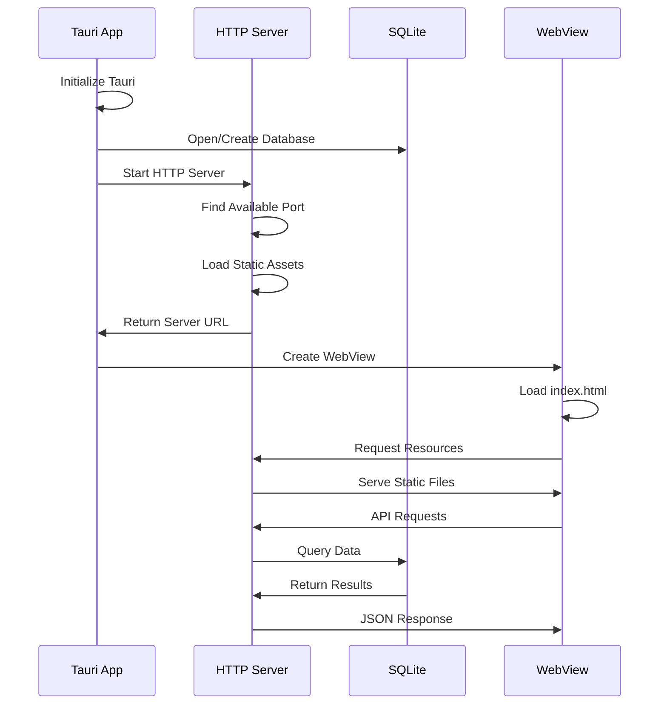

# Vibing2 Desktop Standalone Mode Architecture

## Executive Summary
This document outlines the architecture for making the Vibing2 desktop application fully standalone without requiring a separate Next.js server process. After evaluating four approaches, we recommend the **Hybrid approach** combining a static Next.js build with a lightweight Rust HTTP server.

## Architecture Options Analysis

### Option 1: Embed Node.js Runtime
**Description**: Bundle Node.js runtime with the application and run the full Next.js server.

**Pros:**
- Full Next.js feature compatibility (SSR, API routes, middleware)
- No code rewriting required
- Maintains exact web version parity

**Cons:**
- Large bundle size (~100MB for Node.js alone)
- Slower startup (5-10 seconds)
- Complex dependency management
- Memory overhead (~150MB baseline)
- Security concerns with bundled runtime

**Bundle Size Impact:** ~150-200MB additional
**Startup Time:** 5-10 seconds
**Memory Usage:** 150-300MB

### Option 2: Pure Rust HTTP Server
**Description**: Rewrite the entire backend in Rust, serving static files and implementing API endpoints natively.

**Pros:**
- Smallest bundle size (~5-10MB)
- Fastest startup (<1 second)
- Native performance
- Lowest memory usage (~20-30MB)

**Cons:**
- Complete backend rewrite required
- Loss of Next.js features (SSR, middleware)
- Significant development effort (4-6 weeks)
- Maintenance of two codebases

**Bundle Size Impact:** ~5-10MB additional
**Startup Time:** <1 second
**Memory Usage:** 20-30MB

### Option 3: Tauri Localhost Server
**Description**: Use Tauri's built-in localhost serving capabilities with static files.

**Pros:**
- Built-in Tauri feature
- Simple configuration
- Good performance
- Small bundle size

**Cons:**
- Limited to static files only
- No API route support without additional work
- Requires API endpoint reimplementation

**Bundle Size Impact:** ~2-5MB additional
**Startup Time:** 1-2 seconds
**Memory Usage:** 30-50MB

### Option 4: Hybrid Approach (RECOMMENDED)
**Description**: Static Next.js build + Rust proxy server for API routes + SQLite for data persistence.

**Pros:**
- Balanced bundle size (~10-15MB)
- Fast startup (2-3 seconds)
- Maintains most Next.js features
- Progressive migration path
- Single codebase for UI

**Cons:**
- API routes need Rust implementation
- Initial setup complexity
- Some Next.js features unavailable (SSR)

**Bundle Size Impact:** ~10-15MB additional
**Startup Time:** 2-3 seconds
**Memory Usage:** 40-60MB

## Recommended Architecture: Hybrid Approach

### System Architecture

```
┌─────────────────────────────────────────┐
│         Tauri Application Shell         │
├─────────────────────────────────────────┤
│                                         │
│  ┌───────────────────────────────────┐ │
│  │    Embedded Rust HTTP Server      │ │
│  │  ┌─────────────────────────────┐  │ │
│  │  │   Static File Handler       │  │ │
│  │  └─────────────────────────────┘  │ │
│  │  ┌─────────────────────────────┐  │ │
│  │  │   API Route Handler         │  │ │
│  │  └─────────────────────────────┘  │ │
│  │  ┌─────────────────────────────┐  │ │
│  │  │   WebSocket Handler         │  │ │
│  │  └─────────────────────────────┘  │ │
│  └───────────────────────────────────┘ │
│                                         │
│  ┌───────────────────────────────────┐ │
│  │    Static Next.js Build           │ │
│  │  ├── HTML/CSS/JS files            │ │
│  │  ├── _next/static/                │ │
│  │  └── public/                      │ │
│  └───────────────────────────────────┘ │
│                                         │
│  ┌───────────────────────────────────┐ │
│  │    Embedded SQLite Database       │ │
│  └───────────────────────────────────┘ │
└─────────────────────────────────────────┘
```

### Component Breakdown

1. **Tauri Application Shell**
   - Main application window
   - System tray integration
   - Native menus and shortcuts
   - IPC communication layer

2. **Embedded Rust HTTP Server**
   - Actix-web or Axum framework
   - Serves on random available port
   - Handles static files
   - Implements API endpoints
   - WebSocket support for real-time features

3. **Static Next.js Build**
   - Pre-built HTML/CSS/JS
   - Client-side routing
   - Optimized assets
   - API calls redirected to Rust server

4. **Embedded SQLite Database**
   - Local data persistence
   - User preferences
   - Project storage
   - Authentication tokens

## Implementation Plan

### Phase 1: Server Setup (Week 1)
1. Create Rust HTTP server module
2. Implement static file serving
3. Port detection and binding
4. Basic API route structure

### Phase 2: API Migration (Week 2)
1. Implement authentication endpoints
2. Project management APIs
3. Agent streaming endpoints
4. WebSocket for real-time updates

### Phase 3: Build System (Week 3)
1. Next.js static export configuration
2. Asset bundling and optimization
3. Build script integration
4. Cross-platform testing

### Phase 4: Integration (Week 4)
1. Tauri window configuration
2. IPC communication setup
3. Error handling and logging
4. Performance optimization

## File Structure

```
vibing2-desktop/
├── src-tauri/
│   ├── src/
│   │   ├── server/
│   │   │   ├── mod.rs           # Server module entry
│   │   │   ├── config.rs        # Server configuration
│   │   │   ├── static_files.rs  # Static file handler
│   │   │   ├── api/
│   │   │   │   ├── mod.rs       # API routes module
│   │   │   │   ├── auth.rs      # Authentication endpoints
│   │   │   │   ├── projects.rs  # Project management
│   │   │   │   ├── agents.rs    # Agent endpoints
│   │   │   │   └── stream.rs    # SSE/WebSocket handlers
│   │   │   ├── middleware/
│   │   │   │   ├── mod.rs       # Middleware module
│   │   │   │   ├── cors.rs      # CORS handling
│   │   │   │   ├── auth.rs      # Authentication middleware
│   │   │   │   └── logging.rs   # Request logging
│   │   │   └── utils/
│   │   │       ├── mod.rs       # Utilities module
│   │   │       ├── port.rs      # Port detection
│   │   │       └── path.rs      # Path resolution
│   │   ├── main.rs              # Main entry point
│   │   ├── lib.rs               # Library exports
│   │   └── commands.rs          # Tauri commands
│   ├── Cargo.toml               # Dependencies
│   └── tauri.conf.json          # Tauri config
├── static/                       # Next.js static build output
│   ├── index.html
│   ├── _next/
│   └── public/
└── build-scripts/
    ├── build.sh                 # Build orchestration
    └── bundle.js                # Asset bundling
```

## Startup Sequence



## API Endpoint Mapping

| Original Next.js Route | Rust Implementation | Priority |
|------------------------|---------------------|----------|
| `/api/auth/signin` | `/api/auth/signin` | P0 |
| `/api/auth/signup` | `/api/auth/signup` | P0 |
| `/api/projects/list` | `/api/projects/list` | P0 |
| `/api/projects/save` | `/api/projects/save` | P0 |
| `/api/agent/stream` | `/api/agent/stream` | P0 |
| `/api/health` | `/api/health` | P1 |
| `/api/metrics` | `/api/metrics` | P2 |

## Performance Targets

- **Startup Time:** < 3 seconds
- **Bundle Size:** < 80MB total
- **Memory Usage:** < 100MB idle
- **API Response:** < 100ms local
- **Static File Serving:** < 10ms

## Security Considerations

1. **Local-only Server**
   - Bind to 127.0.0.1 only
   - Random port selection
   - No external network access

2. **Authentication**
   - JWT tokens in secure storage
   - Session management
   - CSRF protection

3. **Content Security**
   - CSP headers
   - XSS prevention
   - Input validation

## Build Configuration

### Next.js Configuration
```javascript
// next.config.mjs
const nextConfig = {
  output: 'export',
  distDir: '../vibing2-desktop/static',
  images: {
    unoptimized: true,
  },
  trailingSlash: true,
};
```

### Cargo Dependencies
```toml
[dependencies]
axum = "0.7"
tower = "0.4"
tower-http = { version = "0.5", features = ["fs", "cors"] }
tokio = { version = "1", features = ["full"] }
serde = { version = "1", features = ["derive"] }
serde_json = "1"
```

## Monitoring & Logging

1. **Application Logs**
   - Structured logging with tracing
   - Log levels (DEBUG, INFO, WARN, ERROR)
   - File rotation

2. **Performance Metrics**
   - Startup time tracking
   - Memory usage monitoring
   - API response times

3. **Error Handling**
   - Graceful degradation
   - User-friendly error messages
   - Crash reporting (optional)

## Testing Strategy

1. **Unit Tests**
   - Server endpoints
   - Static file serving
   - API handlers

2. **Integration Tests**
   - Full application flow
   - Database operations
   - Authentication flow

3. **Performance Tests**
   - Startup time measurement
   - Memory profiling
   - Load testing

## Migration Path

1. **Phase 1:** Basic static serving
2. **Phase 2:** Core API endpoints
3. **Phase 3:** Advanced features (WebSocket, SSE)
4. **Phase 4:** Performance optimization
5. **Phase 5:** Production release

## Risk Mitigation

| Risk | Mitigation |
|------|------------|
| API compatibility | Maintain API contracts, versioning |
| Performance regression | Continuous benchmarking |
| Platform differences | CI/CD with multi-platform testing |
| Bundle size growth | Asset optimization, tree shaking |

## Conclusion

The hybrid approach provides the best balance of performance, maintainability, and development effort. It allows us to leverage Next.js for the UI while gaining the benefits of a native Rust backend for the desktop application.