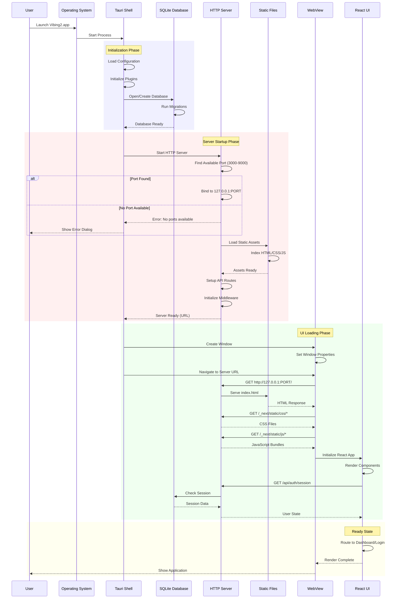
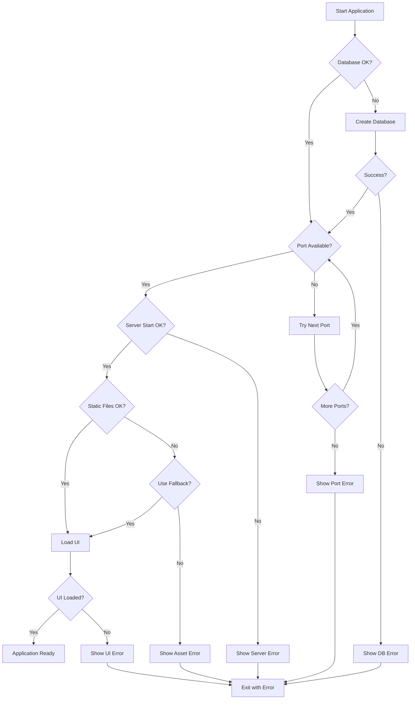
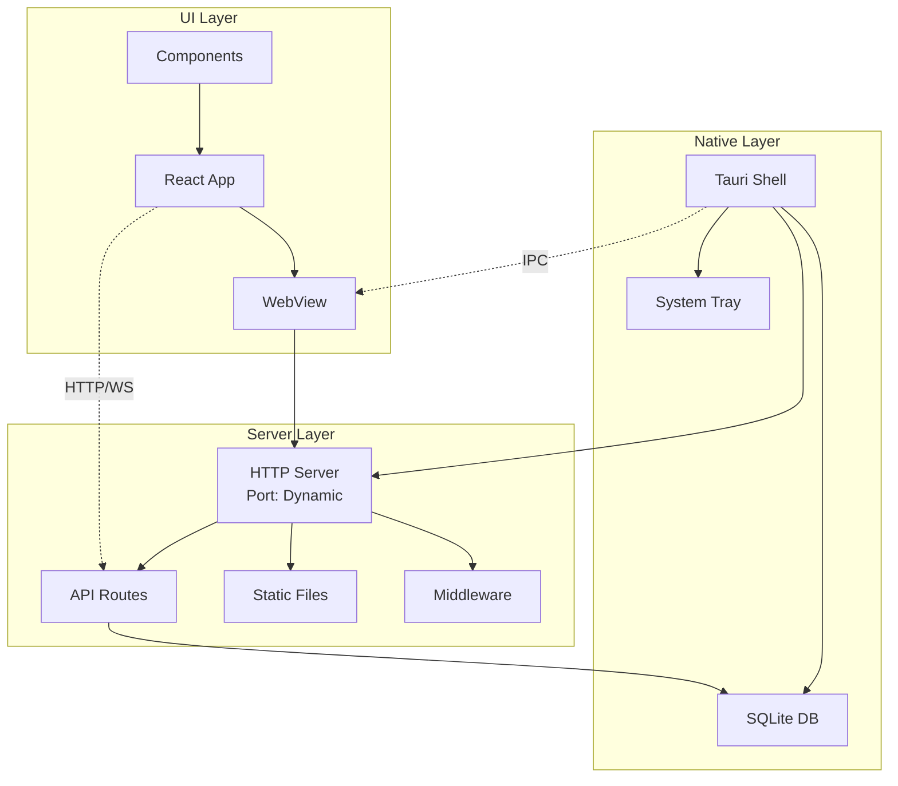
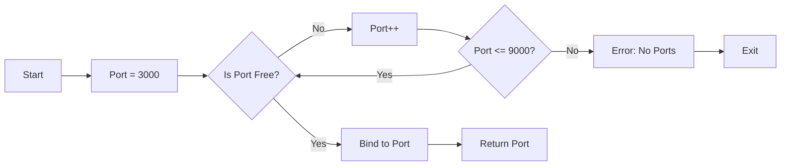
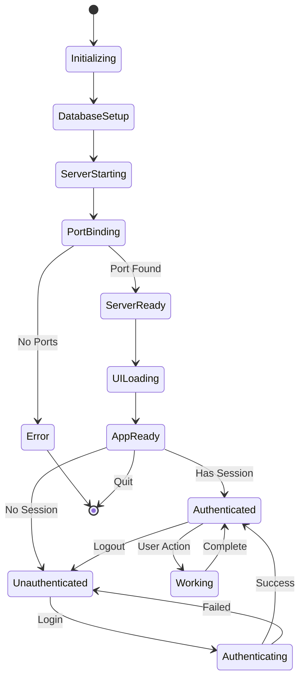
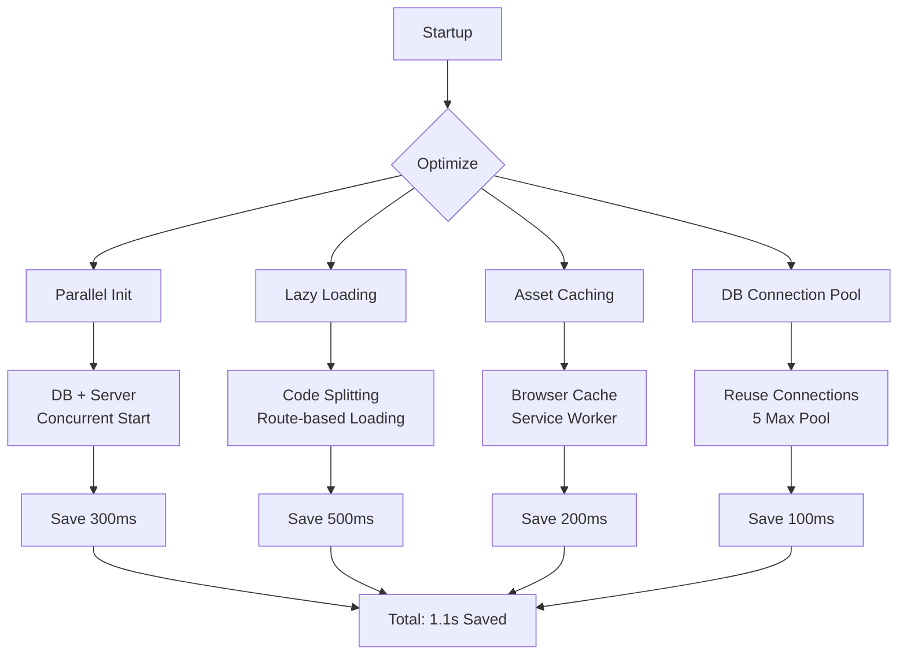
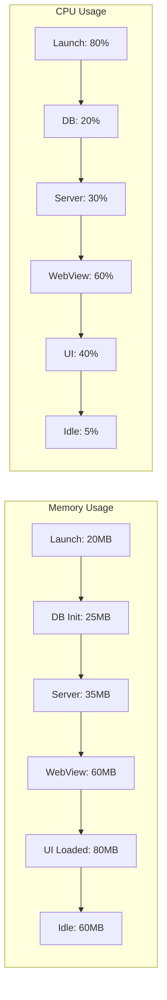

# Vibing2 Desktop - Startup Sequence Diagram

## Complete Startup Flow

## Detailed Timing Breakdown

```mermaid
gantt
    title Vibing2 Desktop Startup Timeline
    dateFormat X
    axisFormat %L ms

    section System
    OS Launch           :0, 100
    Tauri Init          :100, 300

    section Database
    DB Connection       :400, 200
    Schema Migration    :600, 100

    section Server
    Port Detection      :700, 50
    Server Binding      :750, 50
    Route Setup         :800, 100
    Asset Loading       :900, 200

    section UI
    WebView Create      :1100, 200
    HTML Load           :1300, 100
    CSS Load            :1400, 100
    JS Load             :1500, 200
    React Init          :1700, 200
    First Render        :1900, 100
```

## Error Handling Flow

## Component Communication

## Port Selection Algorithm

## State Management Flow

## Performance Optimization Points

## Resource Usage Timeline

## Key Metrics

| Phase | Duration | Memory | CPU |
|-------|----------|--------|-----|
| OS Launch | 100ms | 20MB | 80% |
| Tauri Init | 300ms | 5MB | 30% |
| Database Setup | 300ms | 5MB | 20% |
| Server Start | 400ms | 10MB | 30% |
| UI Loading | 800ms | 25MB | 60% |
| First Render | 100ms | 20MB | 40% |
| **Total** | **2000ms** | **85MB** | **Peak: 80%** |

## Optimization Opportunities

1. **Parallel Initialization**: Start DB and Server concurrently
2. **Asset Preloading**: Bundle critical CSS inline
3. **Lazy Routes**: Load pages on-demand
4. **Service Worker**: Cache static assets
5. **Connection Pooling**: Reuse DB connections